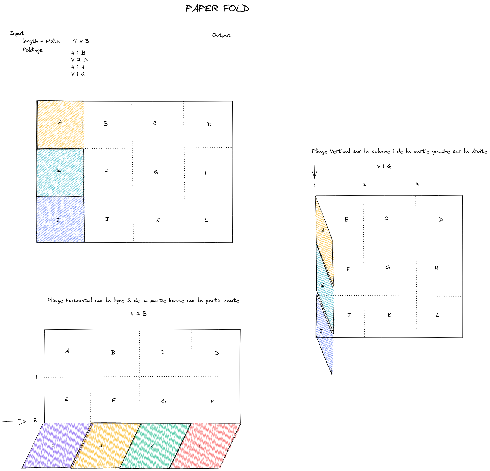

# Paper fold

The "Paper fold" exercise is a program that emulates the folding of a paper and is meant to practice grid manipulation. This repository contains implementation of the *paper fold* exercicse in different languages.

For more details, please check README file of specific implementation.

## Folding paper 

The paper is a grid of letters and can be folded only vertically or horizontally (i.e folding lines and columns in a grid).
The initial state of the paper is a grid where each cell is named with a letter (letter A in the cell (0,0), B in the cell (0,1) , ... (see picture below)).

One can fold horizontally one or more lines by folding the top part onto the bottom part (we will call this a top folding). 

One can fold horizontally one or more lines by folding the bottom part onto the top part (we will call this a bottom folding).

One can fold vertically one or more columns by folding the left part onto the right part (we will call this a left folding).

One can fold vertically one or more columns by folding the right part onto the left part (we will call this a right folding).

The picture below describes these possible foldings.

